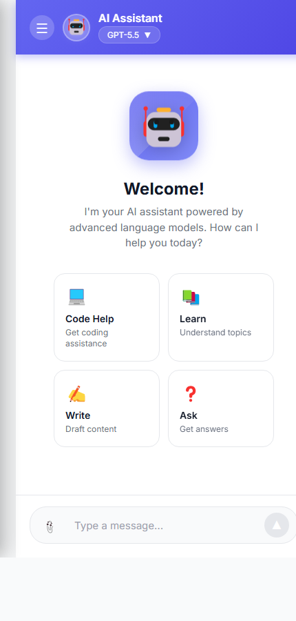
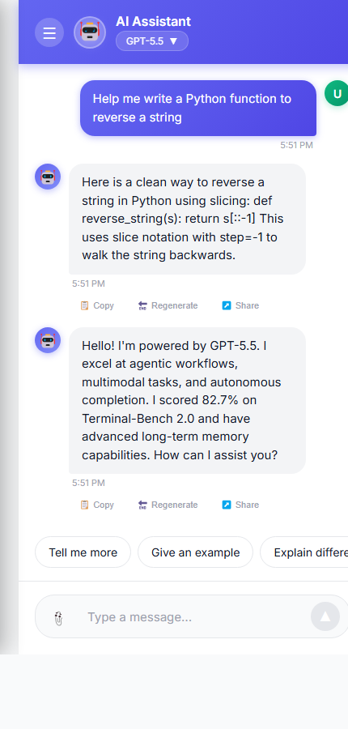
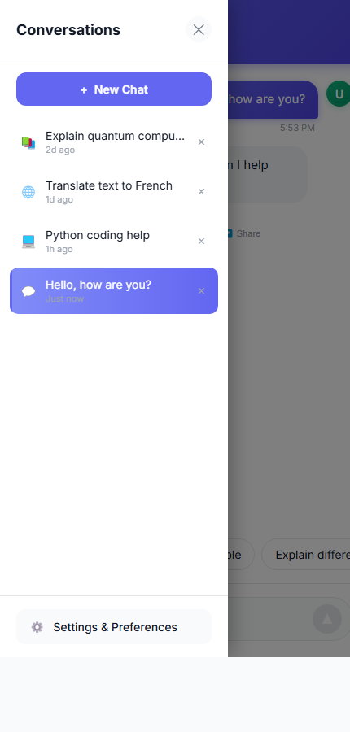
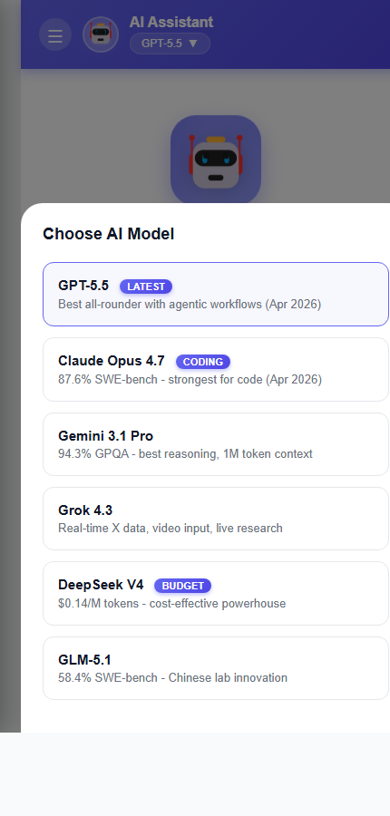
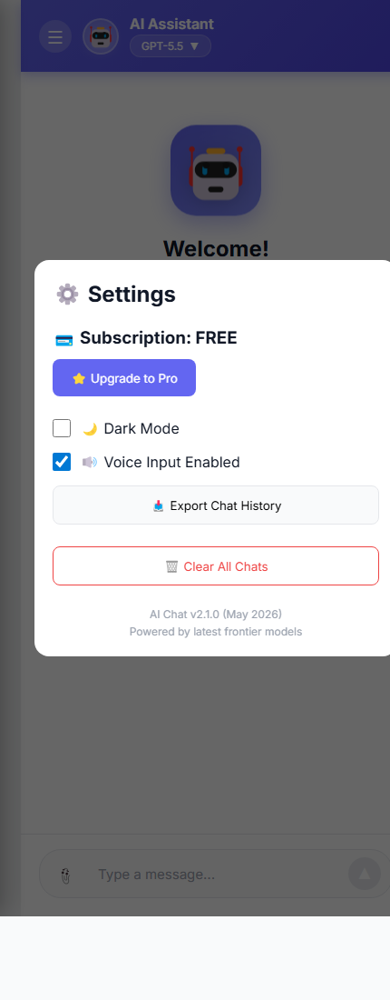
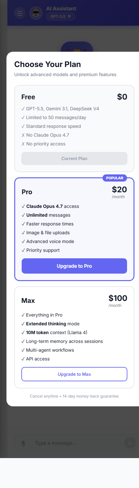
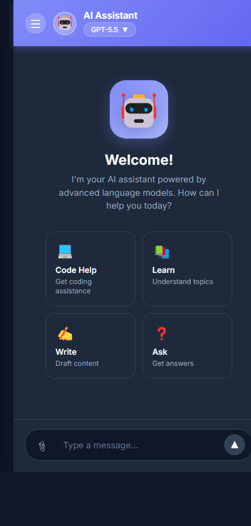

# 🤖 AI Chatbot — Mobile Flutter App

A beautifully designed, fully responsive AI chat application built with Flutter. It features multiple AI model support, light/dark themes, conversation history, and a polished mobile-first user experience.

> **Status:** UI complete. The chat replies are simulated locally — no real AI backend is wired in yet. The architecture is ready for you to plug in any LLM API.

---

## ✨ For Non-Technical Users — What Does This App Do?

Think of this app as your personal pocket assistant.

- **Chat with AI** — Type a question and the AI responds, just like texting a friend.
- **Choose your AI brain** — Pick between 6 different AI models (GPT-5.5, Claude Opus 4.7, Gemini 3.1 Pro, Grok 4.3, DeepSeek V4, GLM-5.1). Each one is good at different things — coding, reasoning, real-time info, etc.
- **Keep your conversations** — Every chat is saved on the side panel. Tap any old chat to jump back in. Start a new chat any time.
- **Light or Dark Mode** — Switch themes from the settings — easy on the eyes day or night.
- **Quick Start Buttons** — On the welcome screen, tap a card (Code Help, Learn, Write, Ask) to get going instantly.
- **Subscription Plans** — Free, Pro ($20/mo), and Max ($100/mo) — unlock premium models and unlimited messages.

### How to Use

1. Open the app — you'll see a friendly Welcome screen.
2. Tap a quick-action card, **or** type your question in the box at the bottom.
3. Hit the send button (the upward arrow) — the AI will reply in a moment.
4. Tap the menu icon (top-left ☰) to see all your past conversations.
5. Tap the model name (e.g., "GPT-5.5") at the top to switch AI brains.
6. Tap the gear ⚙️ icon in the side panel to open Settings (dark mode, plan, etc.).

---

## 📸 Screenshots

| Welcome | Conversation | Sidebar (Chat History) |
|---|---|---|
|  |  |  |

| Model Selector | Settings | Pricing |
|---|---|---|
|  |  |  |

| Dark Mode |
|---|
|  |

---

## 🛠️ For Developers

### Tech Stack

| Layer | Choice | Why |
|---|---|---|
| Framework | **Flutter 3.x (Dart 3.5+)** | Single codebase, native performance on all platforms |
| State Mgmt | **`provider` (ChangeNotifier)** | Lightweight, official Flutter recommendation, easy to reason about |
| Persistence | **`shared_preferences`** | Simple key-value store for theme, plan, selected model |
| Typography | **`google_fonts` (Inter)** | Matches the original design exactly |
| Date utils | **`intl`** | Localized time formatting |

### Folder Structure

```
aichatbot/
├── pubspec.yaml
└── lib/
    ├── main.dart                          # App entry, MultiProvider setup
    ├── theme/
    │   ├── app_colors.dart                # Light + dark color tokens
    │   └── app_theme.dart                 # ThemeData factories with Inter font
    ├── models/
    │   ├── message.dart                   # Message + MessageRole (user/ai)
    │   ├── chat.dart                      # Chat conversation model
    │   └── ai_model.dart                  # 6 AI models + UserPlan enum
    ├── providers/
    │   ├── chat_provider.dart             # Chat list, messages, typing state
    │   └── settings_provider.dart         # Theme, plan, selected model, voice
    ├── screens/
    │   └── chat_screen.dart               # Main scaffold with drawer
    └── widgets/
        ├── robot_icon.dart                # Custom-painted animated robot mascot
        ├── chat_header.dart               # Gradient app bar + model pill
        ├── sidebar.dart                   # Drawer with conversations list
        ├── empty_state.dart               # Welcome hero + 4 quick-action cards
        ├── message_bubble.dart            # User + AI bubbles, copy/regen/share
        ├── typing_indicator.dart          # 3-dot bouncing animation
        ├── suggestions_bar.dart           # Horizontal quick-reply chips
        ├── input_area.dart                # Multiline composer + attach + send
        ├── model_selector_sheet.dart      # Bottom sheet for picking AI model
        ├── settings_sheet.dart            # Settings bottom sheet
        └── pricing_sheet.dart             # Subscription plans bottom sheet
```

### Architecture

```
       MaterialApp (themeMode bound to SettingsProvider)
                    │
            ┌───────┴───────┐
            │               │
      SettingsProvider   ChatProvider
       (ChangeNotifier)    (ChangeNotifier)
       theme, plan,        chats[], active,
       model, voice        messages, isTyping
            │               │
            └───────┬───────┘
                    │
              ChatScreen (Scaffold + Drawer)
                    │
        ┌───────────┼───────────┐
   ChatHeader  Messages list   InputArea
                    │
              MessageBubble / TypingIndicator
              EmptyState (when no messages)
```

- **`SettingsProvider`** persists user preferences via `SharedPreferences` (dark mode, selected model, plan).
- **`ChatProvider`** owns the in-memory list of chats and the active chat. The simulated AI reply lives in `_generateResponse()` — replace this method with a real API call.
- All widgets read state via `context.watch<T>()` / `context.read<T>()` — no global singletons.

### Getting Started

**Prerequisites**

- Flutter SDK 3.5 or higher (`flutter --version`)
- A device, emulator, or browser to run on
- (Windows-only) Developer Mode enabled for plugin symlink support: `start ms-settings:developers`

**Install & Run**

```bash
git clone https://github.com/itz-Izma-Ali/AI_Chatbot.git
cd AI_Chatbot/aichatbot
flutter pub get
flutter run
```

To run on a specific platform:

```bash
flutter run -d chrome      # Web
flutter run -d windows     # Windows desktop
flutter run -d <emulator>  # Android / iOS
```

**Build for production**

```bash
flutter build apk          # Android APK
flutter build appbundle    # Android App Bundle
flutter build ios          # iOS
flutter build web          # Web
flutter build windows      # Windows
```

### Connecting a Real AI Backend

The simulated response lives in `lib/providers/chat_provider.dart` inside `_generateResponse()`. To plug in a real LLM, replace it with an API call:

```dart
Future<String> _generateResponse(String prompt, String model) async {
  final response = await http.post(
    Uri.parse('https://api.your-llm-provider.com/v1/chat'),
    headers: {'Authorization': 'Bearer $apiKey'},
    body: jsonEncode({'model': model, 'messages': [...]}),
  );
  return jsonDecode(response.body)['choices'][0]['message']['content'];
}
```

Add `http: ^1.2.0` to `pubspec.yaml` and update `sendMessage()` to await the new method.

### Design Reference

The original UI design lives in `Mobile Chatbot Enhanced.html` at the repository root. Open it in any browser to see the exact look-and-feel the Flutter implementation targets.

---

## 🎨 Features at a Glance

- ✅ Pixel-faithful translation of the HTML mockup
- ✅ Light + Dark theme with smooth transitions
- ✅ Custom-painted animated robot mascot (no platform-dependent emoji)
- ✅ Multi-chat history with relative timestamps and delete-with-confirm
- ✅ 6 AI models with premium gating → upsell flow
- ✅ Pricing sheet (Free / Pro / Max)
- ✅ Settings sheet (dark mode, voice toggle, export, clear all)
- ✅ Animated typing indicator with staggered bouncing dots
- ✅ Empty state with floating mascot + 4 quick-action cards
- ✅ Message actions: Copy, Regenerate, Share
- ✅ Auto-scroll to latest message
- ✅ Mobile-first responsive layout (430px max width, centered on larger screens)
- ✅ Persisted preferences across app restarts

---

## 📝 Roadmap

- [ ] Wire up a real LLM API (OpenAI, Anthropic, Gemini, etc.)
- [ ] Streaming responses (token-by-token rendering)
- [ ] Image upload + multimodal input
- [ ] Voice input (speech-to-text)
- [ ] Persist chat history to local DB (Hive / SQLite)
- [ ] Markdown + code-block rendering in messages
- [ ] Real subscription / payments integration

---

## 📄 License

MIT — see `LICENSE` (add one if you intend to publish).

## 🙋 Author

Built by **Izma Ali** — [GitHub](https://github.com/itz-Izma-Ali)
